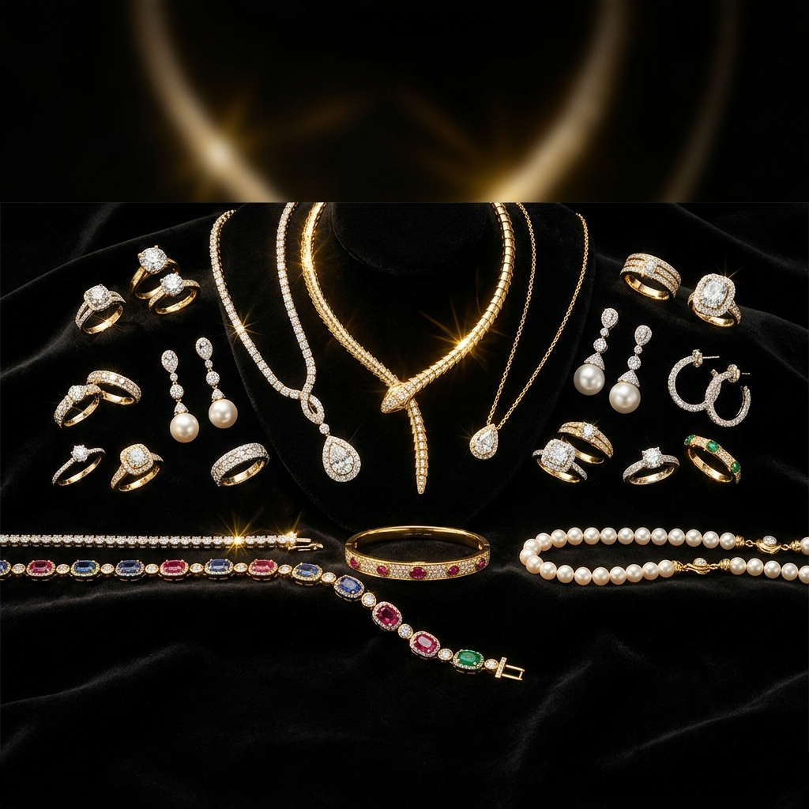
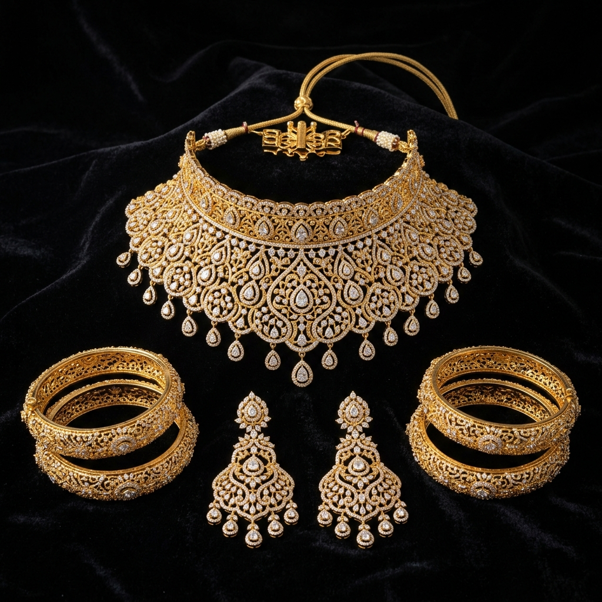

# ✦ ARKSTONE & CO. ✦
> *Where luxury meets legacy. Est. 2005.*

<p align="center">
  
</p>

Welcome to the **ARKSTONE & CO.** official luxury jewelry portfolio. This project is a visually immersive, ultra-premium web presence designed to showcase high-end handcrafted jewelry using fluid, dynamic web design principles.

## 🌟 Visual Showcase

Explore our high-end craftsmanship directly through the curated collections:

<p align="center">
  
  
  
</p>

## ✨ Key Technical Features

- **Geometric Luxury Cursor**: A custom-engineered SVG geometric cursor that dynamically tracks your mouse. It intelligently calculates the brightness of the background elements underneath it and instantly shifts to solid black over light (cream/white) backgrounds to guarantee 100% visibility.
- **Dynamic Particle Canvas**: The hero section features a mathematically driven gold-dust particle system floating elegantly in the background, rendering at 60fps utilizing standard canvas APIs.
- **Scroll Reveal Animations**: Using a vanilla JavaScript `IntersectionObserver`, interface elements carefully cascade and float upwards as the user explores the page down into the craftsmanship and story sections.
- **Interactive Product Filters**: Seamless category tab-switching allows users to seamlessly browse Gold, Diamond, Silver, and Gemstone variants entirely client-side without page reloads.
- **Magnetic Action Buttons**: Call to action buttons softly "snap" and track the user's cursor on hover, delivering a premium, tactile user experience.

## 🛠️ Technology Stack

Built for blistering performance, zero bloat, and pure creative control:
- **HTML5**: Semantic, accessible document structure.
- **Vanilla CSS3**: Leverages modern features like CSS variables, glassmorphism (`backdrop-filter`), mix-blend modes, and complex keyframe animations.
- **Vanilla JavaScript**: Zero external dependencies. Designed natively with the DOM API.

## 🚀 How to Launch Locally

To preview this luxury experience on your own machine:

1. Clone the repository:
   ```bash
   git clone https://github.com/harisudhan657/ARKSTONE-jewels.git
   ```
2. Navigate to the project directory:
   ```bash
   cd ARKSTONE-jewels
   ```
3. Start a local server using Node.js:
   ```bash
   npx serve .
   ```
4. Open the `localhost:3000` URL in your favorite modern browser.

---
<p align="center">
  <i>Every piece, a masterpiece. Crafted with ♦ for those who love fine jewellery.</i>
</p>
